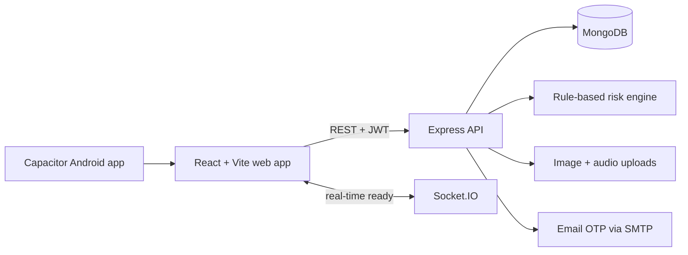

# MineSight - Coal Governance Intelligence Platform

> From inspection evidence to accountable action before a risk becomes an incident.

MineSight is a full-stack, role-aware platform for coal-mine governance. It gives mine officials, corporate teams, administrators, and regulators one operational view of inspections, statutory compliance, contractors, risk signals, alerts, and corrective actions.

Built for **Smart India Hackathon 2026 - Problem Statement SIH 26024**.

## What MineSight Solves

Coal-mine governance data is often split across field notes, photos, spreadsheets, calls, and separate reporting teams. That makes it hard to answer operational questions quickly:

- Which sites have the highest unresolved risk right now?
- Has a violation been assigned, escalated, and closed with evidence?
- What statutory compliance items are nearing or past their due date?
- Can regulators, corporate teams, and mine officials see the same record at the right level of access?

MineSight turns disconnected records into a traceable action loop:

```text
Field inspection + geo-tagged evidence
  -> explainable risk score and severity assessment
  -> alert, escalation, and role-aware dashboard visibility
  -> corrective-action closure and compliance follow-up
```

## Core Capabilities

| Area | What the platform provides |
| --- | --- |
| Evidence-first inspections | Capture inspection type, location, observations, violations, corrective actions, photos, and audio notes in one workflow. |
| Explainable risk scoring | Uses a deterministic rule-based engine so prioritisation is inspectable and auditable. |
| Role-aware governance | Mine officials work in a mine-scoped view; corporate, admin, and regulator roles see broader portfolio data. |
| Alerts and escalation | High-risk and escalated inspections surface through alert workflows. |
| Compliance tracking | Track due dates, statutory references, status, and overdue items. |
| Contractor oversight | Register and monitor contractor records, contact details, safety ratings, and compliance status. |
| Analytics | Review KPIs, recurring violation categories, high-risk inspections, trends, and risk distribution. |
| Field-ready foundation | Supports media uploads, geo-coordinates, responsive UI, and idempotent `offlineId` inspection creation. |

Responsible AI note: the current risk engine is deterministic and explainable, not a black-box ML model. Its inputs and thresholds are inspectable, and the architecture can later support a validated ML model without replacing the core workflow.

## Demo Walkthrough

1. Start on the landing page and show the public mine-performance snapshot, bilingual UI, and light/dark themes.
2. Sign in as a Mine Official using the seeded credentials below to show mine-scoped access.
3. Create an inspection with severity, location, a violation, corrective action details, and field media.
4. Open Analytics to show high-risk inspections, recurring violation categories, and monthly trends.
5. Escalate an inspection or close a violation, then check the linked alert and updated status.
6. Switch to Corporate, Admin, or Regulator to show portfolio-level visibility and management workflows.

## Architecture



| Layer | Technologies | Responsibility |
| --- | --- | --- |
| Frontend | React 18, Vite, Tailwind CSS, Zustand | Responsive role-aware UI, theme/language preferences, maps, charts, and API state. |
| Backend API | Node.js, Express, Socket.IO | REST APIs, validation, authentication, authorization, alerts, and real-time-ready events. |
| Data | MongoDB, Mongoose | Mines, users, inspections, violations, compliance tasks, contractors, alerts, OTPs, audit logs, and chat messages. |
| Maps and analytics | Leaflet, React Leaflet, Recharts | Geo-tagged inspections, map views, risk distribution, recurring violations, and trends. |
| Mobile shell | Capacitor 6, Android project | Packages the built web app into an Android application. |

## Repository Map

```text
MineSight/
|-- backend/              Express/MongoDB API
|   |-- config/           Database connection
|   |-- controllers/      Workflow and business logic
|   |-- middleware/       JWT auth, RBAC, and error handling
|   |-- models/           Governance data models
|   |-- routes/           REST endpoint definitions
|   |-- uploads/          Local development media uploads
|   `-- utils/            Token generation and risk scoring
|-- frontend/             React/Vite web app and Vercel config
|   |-- api/              Vercel serverless API proxy
|   |-- public/           Static assets
|   `-- src/
|       |-- components/   Layout, common UI, and dashboard widgets
|       |-- pages/        Home, auth, dashboard, operations, analytics
|       |-- services/     Axios API client
|       `-- store/        Auth and theme state
`-- mobile/               Capacitor Android wrapper
    |-- android/          Native Android project
    `-- capacitor.config.json
```

## Prerequisites

- Node.js 18+; Node 20 LTS is recommended
- npm
- MongoDB locally or a MongoDB Atlas connection string
- Android Studio and Android SDK, only if building the mobile app

## Quick Start

Install dependencies:

```bash
git clone https://github.com/Mr-Ahad-Khan/MineSight.git
cd MineSight

cd backend
npm ci

cd ../frontend
npm ci
```

On Windows systems where PowerShell blocks `npm.ps1`, use `npm.cmd` instead, for example `npm.cmd ci`.

Create `backend/.env`:

```env
PORT=5000
NODE_ENV=development
MONGO_URI=mongodb://127.0.0.1:27017/coal_governance
JWT_SECRET=replace-with-a-long-random-secret
JWT_EXPIRE=7d

# Optional in development; required when email OTP delivery is enabled
EMAIL_HOST=smtp.example.com
EMAIL_PORT=587
EMAIL_SECURE=false
EMAIL_USER=your-smtp-user
EMAIL_PASSWORD=your-smtp-password
EMAIL_FROM=no-reply@example.com
```

Seed the database and run both apps from separate terminals:

```bash
# Terminal 1 - API
cd backend
npm run seed
npm run dev
```

```bash
# Terminal 2 - web app
cd frontend
npm run dev
```

Open `http://localhost:3000`. In development, Vite proxies `/api` requests to `http://localhost:5000`.

## Demo Credentials

Run `npm run seed` in `backend/` first, then use one of these accounts:

| Role | Email | Password |
| --- | --- | --- |
| Mine Official | `rajesh@ncl.gov.in` | `mine123` |
| Mine Official | `priya@ncl.gov.in` | `mine123` |
| Corporate | `corporate@cil.gov.in` | `corp123` |
| Administrator | `admin@cil.gov.in` | `admin123` |
| Regulator | `regulator@dgms.gov.in` | `reg123` |

## Backend Scripts

Run from `backend/`:

| Command | Purpose |
| --- | --- |
| `npm run dev` | Start the API with nodemon. |
| `npm start` | Start the API with Node. |
| `npm run seed` | Load demo users, mines, inspections, compliance records, alerts, and related sample data. |
| `npm run seed:contractor` | Load contractor demo data. |

Health checks:

- `GET /`
- `GET /api/health`

## Frontend Scripts

Run from `frontend/`:

| Command | Purpose |
| --- | --- |
| `npm run dev` | Start Vite on `http://localhost:3000`. |
| `npm run build` | Build the production web app into `frontend/dist`. |
| `npm run preview` | Preview the production build locally. |

The frontend API client resolves the backend URL in this order:

1. `VITE_API_BASE_URL`
2. `VITE_BACKEND_URI`
3. `VITE_API_URL`
4. Development fallback: `http://localhost:5000/api`
5. Production fallback: `https://minesight.onrender.com/api`

If an environment value does not end in `/api`, the client appends `/api` automatically.

## Mobile App

The mobile project uses Capacitor and wraps the built frontend from `frontend/dist`.

Install mobile dependencies:

```bash
cd mobile
npm ci
```

Build and sync Android assets:

```bash
npm run build:android
```

Build a debug APK:

```bash
npm run build:apk
```

Install the debug APK on a connected Android device or emulator:

```bash
npm run install:android
```

Full Android development flow:

```bash
npm run dev:android
```

## API Surface

All protected endpoints require:

```http
Authorization: Bearer <JWT>
```

| Domain | Key endpoints | Purpose |
| --- | --- | --- |
| Authentication | `POST /api/auth/register`, `POST /api/auth/login`, `GET /api/auth/me`, `PUT /api/auth/profile`, `POST /api/auth/email/request-otp`, `POST /api/auth/email/verify-otp` | Verified onboarding, profile updates, and sessions. |
| Mines | `GET /api/mines`, `POST /api/mines`, `GET /api/mines/:id`, `PUT /api/mines/:id` | Mine portfolio and GIS-ready location records. |
| Inspections | `GET /api/inspections`, `POST /api/inspections`, `GET /api/inspections/:id`, `PUT /api/inspections/:id`, `DELETE /api/inspections/:id`, `PATCH /api/inspections/:id/violations/:violationId` | Evidence capture, risk scoring, escalation, updates, deletion, and violation closure. |
| Compliance | `GET /api/compliances`, `POST /api/compliances`, `GET /api/compliances/overdue`, `PUT /api/compliances/:id` | Statutory task tracking and overdue visibility. |
| Dashboard and analytics | `GET /api/dashboard/summary`, `GET /api/dashboard/analytics` | KPIs, trends, recurring violations, and risk distribution. |
| Alerts | `GET /api/alerts`, `PATCH /api/alerts/read-all`, `PATCH /api/alerts/:id/read` | Risk and escalation follow-up. |
| Contractors | `GET /api/contractors`, `POST /api/contractors`, `PUT /api/contractors/:id` | Contractor registration and monitoring. |
| Public | `GET /api/public/home-stats`, `POST /api/public/chat-messages`, `GET /api/public/chat-messages` | Landing page metrics and chat-message capture. |

## Deployment Notes

### Backend

The backend can run on any Node.js host that supports persistent MongoDB connectivity. Configure:

- `MONGO_URI`
- `JWT_SECRET`
- `JWT_EXPIRE`
- `NODE_ENV=production`
- SMTP variables if email OTP delivery is enabled

Uploaded media use local `/uploads` storage in development. Configure these Render environment variables to store inspection photos, audio, and profile pictures durably in Cloudinary:

- `CLOUDINARY_CLOUD_NAME`
- `CLOUDINARY_API_KEY`
- `CLOUDINARY_API_SECRET`

### Frontend

The frontend is configured for Vercel. For direct browser-to-backend calls, set one of:

- `VITE_API_BASE_URL`
- `VITE_BACKEND_URI`
- `VITE_API_URL`

Example:

```env
VITE_API_BASE_URL=https://your-api.example.com
```

The `frontend/api/[...path].js` catch-all function can also proxy same-origin `/api/*` requests on Vercel. That proxy requires:

```env
BACKEND_URL=https://your-api.example.com
```

Do not point backend-related variables to the frontend's own Vercel URL, because that can route API calls back to the frontend instead of the API.

## Security and Governance Foundations

- JWT-protected private routes with bcrypt password hashing.
- Role-based access control for mine creation, contractor management, and mine-scoped inspection access.
- Email OTP verification before registration; OTPs expire after 10 minutes and limit failed attempts.
- Profile image uploads are limited to 5 MB.
- Inspection media uploads accept images and audio only, with a 25 MB per-file limit.
- MongoDB indexes support geospatial mine and inspection queries, recent inspection retrieval, unread alerts, and expiring OTP records.

## Roadmap

- Integrate verified DGMS/CIL data feeds and statutory-rule libraries.
- Add multilingual field forms, low-connectivity offline queueing, and conflict-aware synchronization.
- Train and validate a risk-prediction model against historical anonymized inspection outcomes while retaining human review and explainability.
- Introduce immutable audit-log workflows, SSO, tenant isolation, encrypted object storage, and operational monitoring.
- Add configurable escalation SLAs and regulator-ready export packs.

## Team Message

MineSight is a practical digital governance layer for making safety evidence visible, risk prioritised, and responsibility traceable from field inspection to decision review.
