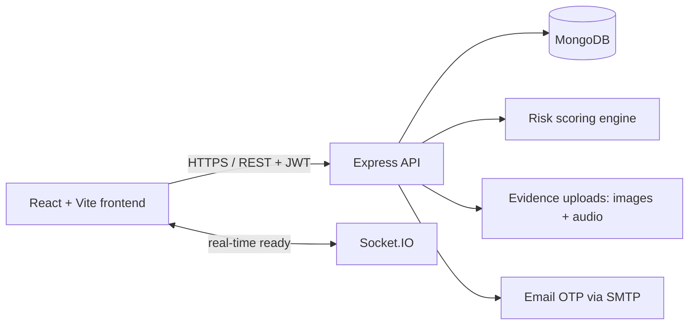

# MineSight — Coal Governance Intelligence Platform

> **From inspection evidence to accountable action — before a risk becomes an incident.**

MineSight is a full-stack, role-aware platform for coal-mine governance. It gives mine officials, corporate teams, and regulators one operational view of inspections, statutory compliance, contractors, risk signals, and corrective actions.

Built for **Smart India Hackathon 2026 · Problem Statement SIH 26024**

## The challenge we address

Coal-mine governance data is often fragmented across field notes, photographs, spreadsheets, calls, and separate teams. That makes it difficult to answer the questions that matter during an inspection or incident:

- Which sites have the highest unresolved risk right now?
- Has a violation been assigned, escalated, and closed with evidence?
- What statutory items are nearing or past their due date?
- Can a regulator, corporate office, and mine team see the same truth at the right level of access?

**MineSight converts those disconnected records into a single, traceable action loop:**

```text
Field inspection + geo-tagged evidence
              ↓
Transparent risk score and severity assessment
              ↓
Alert, escalation, and role-aware dashboard visibility
              ↓
Corrective-action closure and compliance follow-up
```

## Why MineSight matters

| What is different | Value in the field |
| --- | --- |
| **Evidence-first inspections** | Capture inspection details with location, photos, audio, observations, and violations in one workflow. |
| **Explainable risk intelligence** | A transparent, rule-based score combines severity and open/critical violations, making prioritisation defensible and easy to audit. |
| **Action, not just reporting** | High-risk inspections create alerts; escalation and violation closure are tracked in the same system. |
| **Governance by role** | Mine officials operate in their assigned mine context while corporate and administrators manage wider portfolios. |
| **Compliance visibility** | Due dates, status, statutory references, and overdue items make follow-up measurable. |
| **Built for real conditions** | Geo-spatial data, responsive UI, media uploads, and idempotent `offlineId` support help bridge field-to-office workflows. |

> **Responsible AI note:** the current risk engine is deterministic and explainable—not a black-box ML claim. Its inputs and thresholds are inspectable, and the service is designed so a validated ML model can be introduced later without replacing the workflow.

## Capabilities at a glance

### For the mine official

- Create safety, environment, scheduled, surprise, and incident inspections.
- Attach up to five photographs and one audio recording; capture geo-coordinates and observations.
- Record violations, corrective actions, due dates, and closure status.
- See mine-scoped inspections, alerts, and compliance work.

### For corporate and administrators

- Register and manage mines, contractors, users, and compliance records.
- Compare portfolio KPIs, recurring violation categories, high-risk inspections, and six-month trends.
- Use the Socket.IO-enabled backend as the foundation for real-time alert delivery.

### For regulators and decision-makers

- Review a consolidated dashboard of compliance, risk distribution, inspections, alerts, and contractor status.
- Trace an issue from field evidence through escalation and closure.
- Use consistent, API-backed records instead of reconciling separate reports.

## Product walkthrough — a 3-minute judge demo

1. **Start at the landing page.** Show the public mine-performance snapshot, bilingual UI, and accessible light/dark themes.
2. **Sign in as a Mine Official** using the seeded credentials below. Point out that the dashboard is role-scoped.
3. **Create an inspection.** Add location, severity, a violation, and field media. Explain that MineSight calculates risk immediately from explicit rules.
4. **Show prioritisation.** Open Analytics to surface high-risk inspections, recurring violation categories, and monthly inspection/risk trends.
5. **Close the loop.** Escalate an inspection or close a violation; then show the linked alert and updated status.
6. **Switch roles.** Sign in as Corporate or Admin to demonstrate portfolio-level mine and contractor management.

## Architecture



| Layer | Technologies | Responsibility |
| --- | --- | --- |
| Frontend | React 18, Vite, Tailwind CSS, Zustand | Responsive role-aware UI, theme/language preferences, maps, charts, and API state. |
| API | Node.js, Express, Socket.IO | REST APIs, validation, authentication, authorisation, alerts, and real-time extensibility. |
| Data | MongoDB + Mongoose | Mines, inspections, violations, compliance tasks, contractors, users, alerts, OTPs, and messages. |
| Spatial & analytics | Leaflet, GeoJSON points, Recharts | Location-aware inspections, risk distribution, recurring violations, and trends. |

## Security and governance foundations

- JWT-protected private API routes with bcrypt password hashing.
- Role-based access control for mine creation, contractor management, and mine-scoped inspection access.
- Email OTP verification before registration; OTPs expire after 10 minutes and permit a maximum of five failed attempts.
- Media validation allows only images/audio and limits each upload to 25 MB.
- MongoDB indexes support geo-spatial mine/inspection queries, recent inspection retrieval, unread alerts, and expiring OTP records.

## Quick start

### Prerequisites

- Node.js 18+ (Node 20 LTS recommended)
- MongoDB locally or a MongoDB Atlas connection string
- npm

### 1. Clone and install

```bash
git clone https://github.com/Mr-Ahad-Khan/MineSight.git
cd MineSight

cd backend
npm ci

cd ../frontend
npm ci
```

> On Windows systems where PowerShell blocks `npm.ps1`, use `npm.cmd` in place of `npm` (for example, `npm.cmd ci`).

### 2. Configure the backend

Create `backend/.env` with the following values. Keep real credentials out of Git.

```env
PORT=5000
NODE_ENV=development
MONGO_URI=mongodb://127.0.0.1:27017/coal_governance
JWT_SECRET=replace-with-a-long-random-secret
JWT_EXPIRE=7d

# Optional in development; required for production email OTP delivery
EMAIL_HOST=smtp.example.com
EMAIL_PORT=587
EMAIL_SECURE=false
EMAIL_USER=your-smtp-user
EMAIL_PASSWORD=your-smtp-password
EMAIL_FROM=no-reply@example.com
```

### 3. Seed and run

Open two terminals from the repository root:

```bash
# Terminal 1 — API
cd backend
npm run seed
npm run dev
```

```bash
# Terminal 2 — web application
cd frontend
npm run dev
```

Open `http://localhost:3000`. The development server proxies `/api` requests to `http://localhost:5000`.

### Demo credentials

Run `npm run seed` first, then use any of these accounts:

| Role | Email | Password |
| --- | --- | --- |
| Mine Official | `rajesh@ncl.gov.in` | `mine123` |
| Corporate | `corporate@cil.gov.in` | `corp123` |
| Administrator | `admin@cil.gov.in` | `admin123` |
| Regulator | `regulator@dgms.gov.in` | `reg123` |

## Deployment

The frontend is configured for Vercel. In production, configure one of the following:

| Variable | When to use it | Example |
| --- | --- | --- |
| `VITE_BACKEND_URI` or `VITE_API_URL` | The browser calls a public API directly | `https://your-api.example.com` |
| `BACKEND_URL` | A Vercel `/api/*` proxy forwards requests to the API | `https://your-api.example.com` |

Do **not** set `BACKEND_URL` to the frontend’s own Vercel URL: that would make proxy requests loop back to the frontend. The backend also needs `MONGO_URI`, `JWT_SECRET`, and production SMTP variables when email OTP is enabled.

Health check: `GET /api/health`

## API surface

All protected endpoints require `Authorization: Bearer <JWT>`.

| Domain | Key endpoints | Purpose |
| --- | --- | --- |
| Authentication | `POST /api/auth/register`, `/login`, `/email/request-otp`, `/email/verify-otp`; `GET /me` | Verified onboarding and sessions. |
| Mines | `GET/POST /api/mines`, `GET/PUT /api/mines/:id` | Mine portfolio and GIS-ready location records. |
| Inspections | `GET/POST /api/inspections`, `GET/PUT/DELETE /:id`, `PATCH /:id/violations/:violationId` | Evidence, risk, escalation, and closure. |
| Compliance | `GET/POST /api/compliances`, `GET /overdue`, `PUT /:id` | Statutory task tracking. |
| Intelligence | `GET /api/dashboard/summary`, `/analytics`, `/public/home-stats` | KPIs, trends, recurring violations, and home metrics. |
| Alerts | `GET /api/alerts`, `PATCH /read-all`, `PATCH /:id/read` | Risk and escalation follow-up. |

## Roadmap: from prototype to state-scale deployment

- Integrate verified DGMS/CIL data feeds and statutory-rule libraries.
- Add multilingual field forms, low-connectivity offline queueing, and conflict-aware synchronisation.
- Train and validate a risk-prediction model against historical, anonymised inspection outcomes; retain human review and explainability.
- Introduce immutable audit-log workflows, SSO, tenant isolation, encrypted object storage, and operational monitoring.
- Add configurable escalation SLAs and regulator-ready export packs.

## Repository map

```text
MineSight/
├── frontend/             # React/Vite application and Vercel configuration
│   └── src/
│       ├── pages/        # Landing, authentication, operations, analytics, maps
│       ├── components/   # Dashboard and layout UI
│       ├── services/     # API client
│       └── store/        # Authentication, theme, language state
└── backend/              # Express/MongoDB API
    ├── controllers/      # Workflow and business logic
    ├── models/           # Governance data models
    ├── routes/           # REST endpoints
    ├── middleware/       # JWT and RBAC middleware
    └── utils/            # Risk calculation and token utilities
```

## Team message

MineSight is not another dashboard. It is a practical digital governance layer that makes safety evidence visible, risk prioritised, and responsibility traceable—from the pithead to the decision table.

**Safer mines begin with clearer, faster, accountable decisions.**
